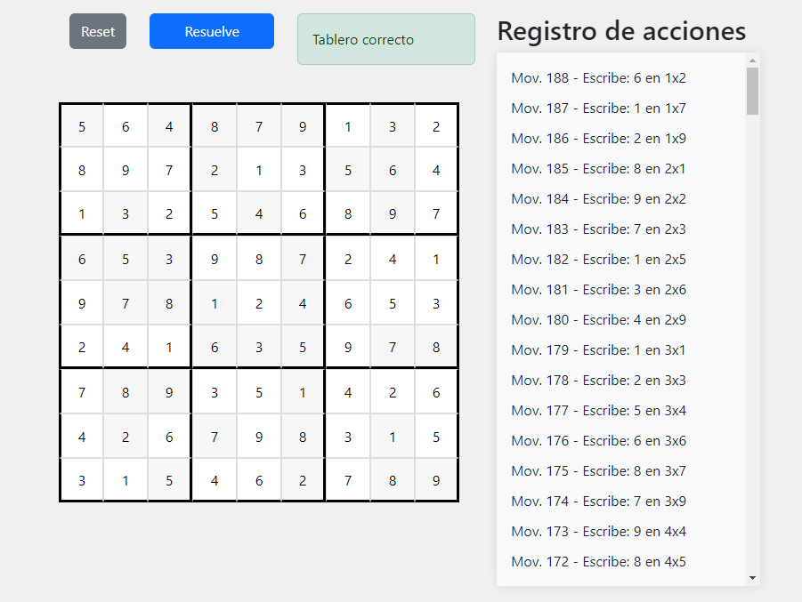

# Sudoku Game

This is a simple Sudoku game built using HTML, CSS, and JavaScript. The game allows players to solve Sudoku puzzles or use an automated player to complete the puzzle for them.



## Features

- Interactive Sudoku grid with input validation.
- Customizable Sudoku board size (default 9x9).
- Randomly generated Sudoku puzzles.
- Ability to manually solve the Sudoku puzzle.
- Automated player that uses a backtracking algorithm to solve the Sudoku puzzle.
- Real-time action log that tracks the player's actions.
- Responsive design with a modern look and feel using Bootstrap.

## How to Play

1. Open the `index.html` file in your web browser.
2. Click the "Reset" button to generate a new Sudoku puzzle.
3. Use your keyboard to fill in the empty cells of the Sudoku grid. The initial cells are read-only and cannot be modified.
4. The game will automatically check your progress and provide feedback on the correctness of your solution.
5. If you get stuck, you can click the "Resuelve" button to let the automated player solve the puzzle for you. The player will use a backtracking algorithm to find the solution step by step, and you can see its progress in the action log.

## How the Automated Player Works

The automated player uses a recursive backtracking algorithm to solve the Sudoku puzzle. It starts at the top-left cell and attempts to place a number between 1 and 9. If the number is valid (i.e., it doesn't conflict with other numbers in the same row, column, or 3x3 box), it moves on to the next empty cell and repeats the process. If it reaches a dead-end where no valid number can be placed, it backtracks to the previous cell and tries a different number. The process continues until a solution is found or all possibilities are exhausted.

## Customization

You can customize the size of the Sudoku board by changing the value of `size` in the `Sudoku` constructor. For example, to create a 9x9 Sudoku puzzle, you can use:

```javascript
const sudoku = new Sudoku(9, true);
```

Additionally, you can modify the appearance of the game by editing the CSS in the `styles.css` file.

## Credits

The Sudoku game is built by Iker Ocio Zuazo as a project to practice web development skills. It uses the Bootstrap framework for responsive design and styling.

## License

This project is licensed under the [MIT License](LICENSE). Feel free to use and modify the code for your own purposes. If you create something cool with it, I'd love to see it!

Enjoy playing Sudoku!
